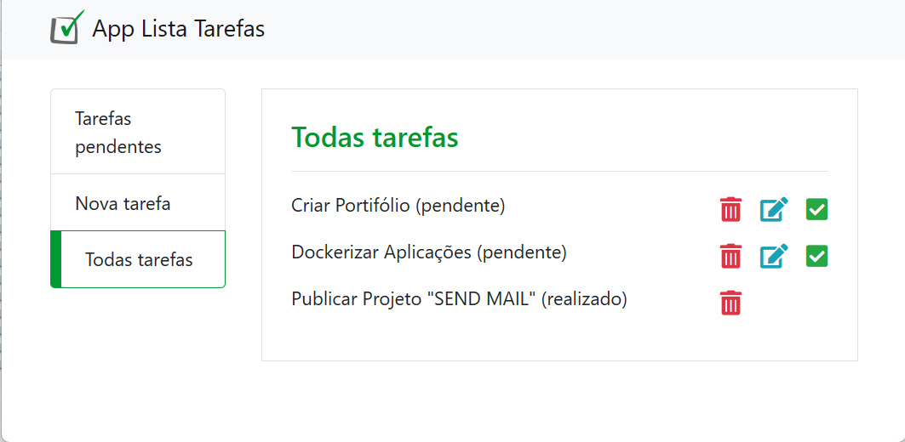

# LISTA DE TAREFAS EM PHP COM BANCO DE DADOS MYSQL



Este projeto consiste em uma aplicação web de lista de tarefas desenvolvida em PHP com banco de dados em MySQL. A lista de tarefas é uma funcionalidade muito útil para organizar as atividades do dia a dia, e a aplicação permite que o usuário adicione, edite e remova tarefas, bem como as marque como concluídas.

A aplicação utiliza o padrão MVC (Model-View-Controller) para separar as responsabilidades de cada componente da aplicação. O banco de dados MySQL é utilizado para armazenar as tarefas, e o PHP é responsável pela lógica da aplicação e pela conexão com o banco de dados.

O usuário pode adicionar uma nova tarefa na lista, informando o título e a descrição da tarefa. É possível também editar e remover tarefas da lista. Além disso, as tarefas podem ser marcadas como concluídas, e o usuário pode visualizar apenas as tarefas pendentes ou as tarefas concluídas.

A aplicação utiliza o PDO (PHP Data Objects) para realizar as operações no banco de dados de forma segura e evitar ataques de injeção de SQL. Além disso, é utilizado o Bootstrap para a criação do layout responsivo e amigável ao usuário.

Com este projeto, é possível aprender a desenvolver uma aplicação web completa em PHP com banco de dados em MySQL, além de praticar conceitos como padrão MVC, operações em banco de dados com PDO e utilização do Bootstrap para criação de layouts responsivos.

### Requisitos Adicionais

É necessário configurar o arquivo de conexão com o banco de dados `conexao.php` com as credenciais do banco de dados MySQL, conforme o exemplo abaixo:

```php
<?php
class Conexao {
    private $host = 'localhost';
    private $dbname = 'php_com_pdo';
    private $user = 'root';
    private $pass = '';
    
    // ...   
}
?>
```
É necessário criar a tabela de tarefas no banco de dados MySQL, utilize o script disponibilizado em `banco_dados.sql`
